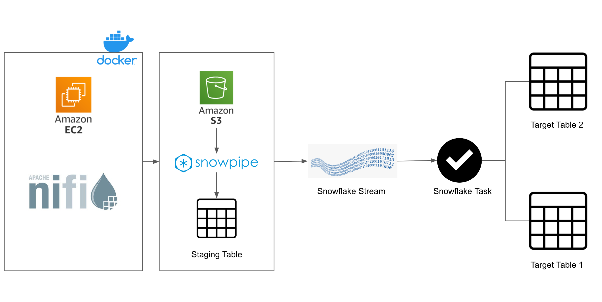

# ⛓️ End-to-End Data Pipeline with AWS EC2, Apache NiFi, AWS S3,Docker and Snowflake (SCD1 & SCD2)

This repository showcases a **real-world end-to-end data pipeline** that simulates change data capture and slowly changing dimensions using a modern **data engineering stack**. The project demonstrates how to ingest streaming data with **Apache NiFi**, land it in **AWS S3**, and automatically load it into **Snowflake**. Once in Snowflake, the pipeline applies **Slowly Changing Dimension (SCD)** Type 1 and Type 2 logic using Snowflake Streams and Tasks to maintain both current and historical records. The entire workflow is orchestrated on an **AWS EC2** instance using **Docker**, making it easy to deploy and reproduce. This project is designed as a portfolio piece to highlight data engineering skills in cloud infrastructure, pipeline automation, and data warehousing best practices.


## 🧱 Tech Stack

- **Amazon EC2** – Cloud VM infrastructure hosting the pipeline (running Docker containers for NiFi and JupyterLab).
- **Snowflake** — Cloud data warehouse where data is loaded and transformed. It holds the staging table as well as the target dimension tables.
- **Amazon S3** — Data lake storage for raw CSV files and for Snowflake to ingest from. Acts as the landing zone for NiFi outputs and a source   for Snowpipe.
- **Faker + Python** — Used to generate synthetic source data (customer records) with realistic values. A JupyterLab notebook uses Faker to                             create CSV files simulating new and updated customer information.
- **Snowpipe** — Snowflake’s continuous ingestion service, set up to automatically load new files from the S3 bucket into a Snowflake staging 
                 table (customer_raw).
- **Snowflake Streams & Tasks** — Used for orchestration of data transformations:  
 -Stream on the staging table captures new rows as they arrive (for SCD Type 1).  
 -Stream on the main table captures changes in the dimension table (for SCD Type 2 history).  
 -Task schedules a stored procedure to merge new data from staging into the main customer table (Type 1).  
 -Task schedules a merge from the change stream into the customer_history table (Type 2).  
- **Docker & Docker-Compose** — SQL scripts define the database schema, stage, pipe, and implement the SCD Type-1 and Type-2 transformations using MERGE statements and stored procedures.


---

## 📊 Architecture



This pipeline runs on an EC2 instance using Docker to host Apache NiFi and Jupyter. Fake customer data is generated with Python (Faker) and saved as CSV files. NiFi picks up these files and uploads them to an S3 bucket.  

Snowflake’s Snowpipe watches the bucket and loads the new files into a staging table. From there:  
1. One Stream + Task moves the new records into the main customer table (SCD Type 1).  
2. Another Stream + Task tracks changes and writes historical versions to a separate table (SCD Type 2).  

The whole setup mimics a real-world system where customer data changes over time — capturing both the current and historical views automatically.

---

## 📌 Key Features

- **End-to-End Pipeline** – Fully automated data flow from data generation to analytics-ready tables.
- **Apache NiFi Ingestion** – Low-code data ingestion using NiFi to simulate a streaming source.
- **Automated Snowflake Loading (Snowpipe)** – Auto-load new files from S3 into Snowflake in near real-time.
- **Slowly Changing Dimensions (SCD1 & SCD2)** – Implementation of SCD logic on customer data.
- **Snowflake Streams & Tasks** – Automate ELT with built-in tools instead of external orchestrators.
- **Real-World Use Case Simulation** – Handles evolving data like updates to customer profiles.
- **Synthetic Data Generation** – Create fake customer data to simulate updates and new entries.
- **Infrastructure as Code** – All setup defined through SQL and Docker scripts.

---

## 📂 Folder Structure

- `sql/` — All SQL scripts for table creation, data loading, and SCD transformations.
- `faker.ipynb` — Notebook that generates fake customer data and pushes to S3.
- `architecture/` — Project pipeline diagram.
- `docker-compose.yml` — Sets up supporting services (if any in real scenario).
- `commands.txt` — Helpful CLI and Snowflake commands.

---

## 🚀 Run the Pipeline

### 1. Create Snowflake Objects
```sql
-- Run sql/1_table_creation.sql
-- Run sql/2_data_loading.sql to create stages, file formats, and pipes
```

### 2. Run Data Generator
```bash
jupyter notebook notebooks/faker.ipynb
# Or run as script to generate fake customer records into S3
```

### 3. Monitor Snowpipe
```sql
SELECT SYSTEM$PIPE_STATUS('customer_s3_pipe');
SELECT * FROM customer_raw;
```

### 4. Apply Transformations
```sql
-- Run sql/3_scd1.sql or sql/4_scd2.sql depending on scenario
```

---

## 📚 Learning Outcomes

- Built and deployed infrastructure using EC2 and Docker.
- Ingested and transformed data using NiFi and Snowflake.
- Applied SCD Type 1 and Type 2 for customer data warehousing.
- Used Streams and Tasks in Snowflake for automated, scalable ELT.
- Simulated realistic use cases using synthetic data generation.
- Troubleshot cross-system pipeline from data generation to warehousin

---

## 🪪 License

This project is designed to reflect the real-world skills required for a Data Engineer role and can be extended further with Airflow, monitoring tools, or dbt for modeling. Feel free to fork and extend!
